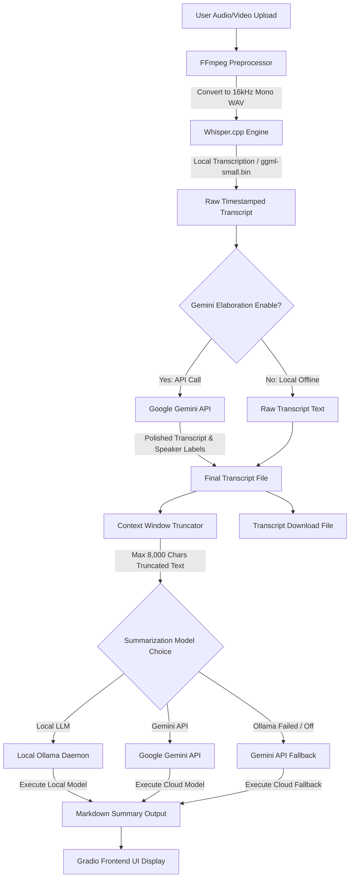

# 🎤 AI Meeting Summarizer — Project Documentation & Architectural Blueprint

This document provides an in-depth, comprehensive breakdown of the **AI Meeting Summarizer** project. It details the system architecture, how the frontend and backend interact, the software utilities and libraries utilized, the deep-learning models employed, their underlying mechanisms, and the complete step-by-step data execution workflow.

---

## 1. Project Overview & Design Philosophy

The **AI Meeting Summarizer** is designed to transform meeting recordings (audio or video) into formatted transcripts and highly structured summaries. It operates under a **local-first, privacy-centric design philosophy**. 

By orchestrating localized components—**Whisper.cpp** for speech-to-text and **Ollama** for large language models (LLMs)—the application ensures that sensitive meeting discussions remain entirely private and are processed on local hardware without sending data to the cloud. For scenarios where cloud access is desired or local computation is constrained, the project integrates an advanced cloud fallback layer using the **Google Gemini API** and **OpenAI GPT-4**.

---

## 2. High-Level Architecture & System Workflow

The project consists of two separate application structures: a **Python + Gradio Local Application** (configured in `main.py` and run via `run_meeting_summarizer.sh`), and a **Next.js + Tailwind React App** (located in the root/app directories). 

Here is the architectural data flow for the main Python application:



---

## 3. Frontend & Backend Interaction Breakdown

### A. The Python & Gradio App (`main.py`)
This represents the primary local desktop application version.

1. **Frontend (Gradio UI Blocks)**:
   * **Layout**: Built using Gradio’s newer `gr.Blocks` layout engine instead of the rigid `gr.Interface`. This allows a highly customized, web-like multi-view dashboard structure.
   * **Dashboard View**: Displays card features (Transcription, Summarization, Privacy) and a "🚀 Enter Application" button to toggle the dashboard visibility.
   * **Main App View**: A modern grid containing a left input column (file picker, optional text context, Whisper model selection, LLM model selection, and a status check) and a right output column containing a tabbed interface (Summary, Transcript, and File Download link).
   * **Theme & Styling**: Uses custom embedded CSS (`custom_css`) providing:
     * **Glassmorphism**: Backdrop blur filters, borders with sub-pixel opacity, and semi-transparent cards (`rgba(255,255,255,0.7)` and `rgba(24,24,27,0.6)`).
     * **Animated Gradients**: Backgrounds loop through an elegant CSS keyframe animation cycle.
     * **Modern Typography**: Heading font styles are loaded via Google Fonts ("Outfit" and "Inter").
     * **Status Card**: Features a pulsing animation indicating whether the local Ollama daemon is actively connected or disconnected.
     * **Theme Switcher**: Runs inline client-side JavaScript (`toggle_theme_js`) to store preferences in `localStorage` and dynamically toggle the `.dark` class across the DOM.

2. **Backend (Python Callback Handler)**:
   * Serves as the orchestrator. When the user clicks the "🚀 Generate Summary" button, Gradio executes the Python function `translate_and_summarize` as an asynchronous thread handler.
   * This handler manages temporary file names, calls subprocesses, communicates with localhost REST APIs, queries cloud endpoints, and returns the result components back to the Gradio input elements.

---

### B. The Next.js React Web App (`app/` & `components/`)
This is a modern React web implementation.

1. **Frontend (Next.js 16 Client)**:
   * Located in `components/meeting-summarizer.tsx`. It runs as a `'use client'` component, offering a responsive drag-and-drop file interface, direct transcript input text areas, loading animations, and copy-to-clipboard elements.
   * Leverages Tailwind CSS and Radix UI components (packaged via Shadcn UI) to provide a desktop-grade, componentized application layout.

2. **Backend / API Wrapper (`lib/summarize.ts`)**:
   * Uses the **Vercel AI SDK** (`ai` package) to orchestrate structured outputs.
   * **Structured JSON Extraction**: Defines a `summarySchema` using **Zod** to validate that the return payload contains a `summary` string, `keyPoints` array, and an `actionItems` array.
   * Queries the API endpoint (e.g., OpenAI GPT-4 Turbo) to compile text. If no API keys are present in the environment (`OPENAI_API_KEY` or `AUTH0_SECRET`), it gracefully runs a localized mock data generator (`generateMockSummary`) to provide functional representations.

---

## 4. Software, Libraries, and Tools Used

The application relies on several core software layers and libraries, broken down by their function:

### A. System-Level Utilities & Binary Components
* **FFmpeg**: A cross-platform CLI tool for handling audio/video files. The backend uses it to unpack media formats (MP3, M4A, MP4, MKV, AVI, etc.) and convert them to the strict uncompressed WAV format required for transcription.
* **Whisper.cpp**: A high-performance, lightweight port of OpenAI's Whisper model written in C/C++ by Georgi Gerganov. It runs directly as compiled binary executables (e.g., `whisper-cli.exe` on Windows or `whisper-cli` on macOS/Linux), eliminating Python ML framework overhead.
* **Ollama**: A local service manager that runs Large Language Models locally. It exposes a local server API endpoint (`http://localhost:11434/api/generate`) that the backend queries for text generation.

### B. Python Libraries (`requirements.txt`)
* `gradio==4.44.1`: Provides the UI building blocks, interactive input fields, state triggers, theme interfaces, and launches the local Python web server (default port `7860`).
* `requests==2.32.3`: Used for making lightweight, synchronous HTTP POST and GET requests to the Ollama model API and Google Gemini API endpoints.
* `ffmpeg-python==0.2.1`: A wrapper that provides Python-style bindings for constructing FFmpeg command lines.

### C. Node.js Frontend Dependencies (`package.json`)
* `next` (v16.2.6): React framework for server-rendered page configurations and app routers.
* `react` & `react-dom` (v19): Modern UI library.
* `ai` & `@ai-sdk/react`: Vercel's AI SDK to stream responses and enforce structural model schemas.
* `lucide-react`: Out-of-the-box vector icon set for interface buttons.
* `zod`: TypeScript-first schema declaration and validation library.

---

## 5. Under-the-Hood AI Models & Mechanisms

The project utilizes three distinct tiers of artificial intelligence models, matching different phases of the workload:

```
┌─────────────────────────────────────────────────────────────────────────┐
│                          PROJECT MODEL TIER                             │
├───────────────────┬──────────────────────────────┬──────────────────────┤
│ Model Purpose     │ Local / Offline Engine       │ Cloud / API Fallback │
├───────────────────┼──────────────────────────────┼──────────────────────┤
│ Transcription     │ Whisper.cpp (GGML format)    │ N/A                  │
├───────────────────┼──────────────────────────────┼──────────────────────┤
│ Text Clean-Up     │ N/A                          │ Gemini 2.5 Flash     │
├───────────────────┼──────────────────────────────┼──────────────────────┤
│ Summarization     │ Ollama (Llama/Mistral)       │ Gemini 2.5 Flash     │
│                   │                              │ OpenAI GPT-4 Turbo   │
└───────────────────┴──────────────────────────────┴──────────────────────┘
```

### 1. Whisper Speech-to-Text (Local)
* **Underlying Model**: OpenAI’s Whisper model weights quantized into the GGML binary model format (e.g., `ggml-small.bin`, `ggml-medium.bin`).
* **Acquisition**: Downloaded via script and placed in `whisper.cpp/models/`.
* **Execution**: Whisper.cpp acts as an acoustic encoder-decoder. It segments audio files into 30-second windows, computes log-Mel spectrograms, and decodes the audio into text tokens. It runs directly on the CPU (using multi-threading) or GPU, extracting precise timestamp markers (e.g., `[00:00:12.000 -> 00:00:15.000]`).

### 2. Google Gemini API (Cloud)
* **Underlying Model**: `gemini-2.5-flash`
* **API Endpoint**: `https://generativelanguage.googleapis.com/v1beta/models/gemini-2.5-flash:generateContent`
* **Duties**:
  * **Transcript Elaboration**: The raw text output from Whisper.cpp can contain acoustic transcription errors or lack formatting. Gemini is prompted to proofread the text, fix grammar, correct technical terms, and label separate speakers by comparing dialogue patterns while maintaining exact timestamps on every line.
  * **Fallback Summarization**: Acts as a high-speed summarizer if the local Ollama instance is not running, or if local CPU processing is too slow.

### 3. Ollama LLMs (Local)
* **Underlying Models**: Supports any model pulled via Ollama (e.g., `llama2`, `llama3.2`, `mistral`, `orca-mini`).
* **Mechanism**: Runs autoregressive local inference. It receives a custom system prompt that dictates markdown formatting structure (Overview, Timeline, Decisions, Action Items) and instructs the model to omit timestamps in the summary, creating a clean chronological narrative.

---

## 6. Detailed Step-by-Step Execution Workflow

When a user submits an audio file in the Python Gradio application, the following sequences occur:

### Phase 1: Input & Verification
1. The user uploads an audio/video file and chooses a Whisper model (e.g., `small`) and a summary model (e.g., `llama3.2`).
2. The application copies the input file to a local path (`temp_input_[name]`) to bypass Gradio/OS temporary folder locking issues.

### Phase 2: Audio Preprocessing (FFmpeg)
1. Python executes FFmpeg with the arguments:
   ```bash
   ffmpeg -y -i [input_temp_file] -vn -ar 16000 -ac 1 [output_wav_file]
   ```
   * `-vn`: Discards any video streams (for faster conversion).
   * `-ar 16000`: Resamples the audio rate to 16,000 Hz.
   * `-ac 1`: Combines audio channels into a single mono stream.
2. The local temporary input copy is immediately deleted.

### Phase 3: Speech-to-Text Transcription (Whisper.cpp)
1. The app detects the host CPU core count (`os.cpu_count()`) to allocate worker threads dynamically (e.g., `-t 8` threads).
2. It constructs a command-line array and runs `whisper-cli.exe` as a subprocess, writing stdout straight to `output.txt`.
3. The raw transcript is saved to `transcript.txt`.

### Phase 4: Cloud-Based Transcript Refinement (Gemini)
1. If the Gemini API key is active, the app sends the raw transcript to the `gemini-2.5-flash` endpoint.
2. The model fixes transcription bugs, punctuation, grammatical mistakes, and inserts inferred speaker labels next to the timestamps.
3. The cleaned transcript replaces the raw content in `transcript.txt`.

### Phase 5: Context Window Management & Truncation
1. To prevent LLM context window overflows, the transcript string is truncated to a safe ceiling of **8,000 characters** (~2,000 tokens).
2. If truncation occurs, the indicator text `\n\n[... transcript truncated ...]` is appended.

### Phase 6: Summarization
1. If **Gemini** was selected (or local Ollama fails/is offline), the app queries the Gemini API.
2. If a **Local Ollama model** was selected, the app makes an API request to the local Ollama daemon. The request uses the streaming API (`/api/generate` with `"stream": true`), parsing JSON responses line-by-line until the `"done"` flag evaluates to True.
3. If both local and cloud services are down, error messages are generated advising the user how to configure their services.

### Phase 7: UI Update & Cleanup
1. The generated summary and final structured transcript are displayed in their respective text areas on the UI.
2. The finalized `transcript.txt` is referenced in the download component.
3. The preprocessed WAV file and raw output files are deleted from the disk to reclaim storage space.

---

## 7. Key Performance Optimizations

1. **Minimized Dependency Tree**: Removing heavy neural network libraries (PyTorch, Transformers, TensorFlow) from the Python environment reduced the package list down to just three packages, cutting down installation time by 90% and system memory footprint to ~300MB.
2. **REST API Model Caching**: The application queries Ollama's `/api/tags` endpoint and caches the list of available models for 5 minutes, resolving cold startup lag.
3. **Subprocess Thread Allocation**: Rather than hardcoding threads, the application checks active hardware resources (`os.cpu_count()`) to maximize CPU core utilization during transcription.
4. **Context Limiting**: The 8,000 character restriction prevents LLM timeouts and maintains fast summary generation times (under 60 seconds).
