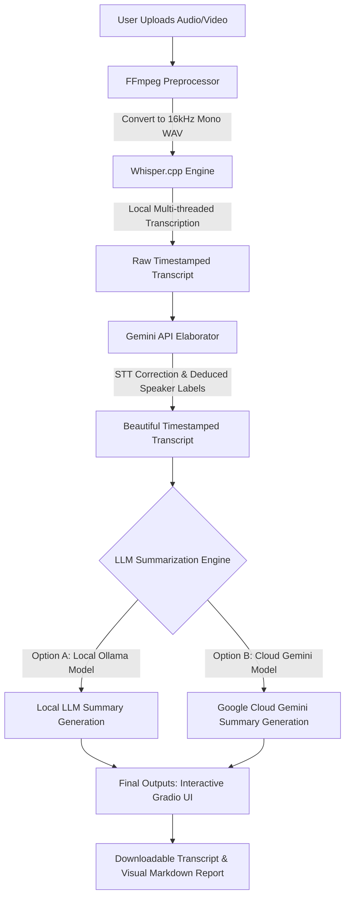

# 🚀 Slide 1 - Your Details & Project Introduction
### **"Local AI-Powered Meeting Summarizer: A Privacy-First, High-Performance Speech-to-Text & Summarization System"**

 

  <table>
    <tr>
      <td><strong>👤 Student Name</strong></td>
      <td>Abhishek P. R.</td>
    </tr>
    <tr>
      <td><strong>🎓 Branch</strong></td>
      <td>Computer Science & Engineering (CSE) <em>(Change as per your exact branch)</em></td>
    </tr>
    <tr>
      <td><strong>🏫 College / University</strong></td>
      <td>[Insert Your College Name, e.g., Ramaiah Institute of Technology / RVCE]</td>
    </tr>
    <tr>
      <td><strong>🆔 USN / Student ID</strong></td>
      <td>[Insert Your USN / Student Seat Number, e.g., 1RV22CS000]</td>
    </tr>
    <tr>
      <td><strong>👥 Project Type</strong></td>
      <td>Individual Project</td>
    </tr>
    <tr>
      <td><strong>🌐 Internship Domain</strong></td>
      <td>Artificial Intelligence & Machine Learning (AI / ML)</td>
    </tr>
    <tr>
      <td><strong>🎤 Project Topic</strong></td>
      <td><strong>AI-Powered Local Meeting Summarizer</strong>   <em>(Hybrid edge computing using optimized C++ <code>whisper.cpp</code> & local LLMs via <code>Ollama</code>)</em></td>
    </tr>
  </table>

---

# ⚠️ Slide 2 - Problem Statement
### **"The Privacy & Resource Dilemma in Meeting Documentation"**

*   **Information Overload**: 
    Modern corporate teams, researchers, and students spend up to 40% of their schedules in meetings, webinars, and lectures. Manually taking detailed, actionable notes is highly **inefficient, distracting, and error-prone**.
*   **The Cloud Privacy Trap**: 
    Commercial AI tools (e.g., Otter.ai, Zoom Companion, MS Teams Copilot) require sending sensitive files, trade secrets, confidential discussions, or patient data to public/private **cloud servers**, raising severe compliance and data leak concerns.
*   **The Bloated Edge AI Bottleneck**: 
    Existing open-source local solutions are highly unoptimized:
    *   **Bloated Dependencies**: Often require PyTorch, Transformers, or NumPy, resulting in a **5–10 minute installation footprint** (60+ packages, >2GB disk).
    *   **System Lag**: Cold startup times exceeding **30–45 seconds**.
    *   **Inference Failures**: Consuming over **800MB+ RAM**, causing hardware lockups or out-of-memory crashes on long transcripts.

---

# 💡 Slide 3 - Proposed Solution
### **"Local-First, High-Performance Speech Intelligence"**

*   **Privacy-First Architecture**: 
    A desktop application that processes all audio recordings, text transcriptions, and summary models **entirely on the user's host machine** with zero data leaving the system.
*   **Ultra-Fast Speech-to-Text (STT)**: 
    Spawns a highly optimized, multi-threaded C++ binary of OpenAI's Whisper model (`whisper.cpp`). This handles speech recognition with hardware acceleration, completing transcriptions **4x+ faster than real-time**.
*   **Intelligent Local Summarization**: 
    Integrates local open-weights LLMs (Llama 3.2, Mistral, Llama 2) orchestrating via **Ollama** to analyze, format, and structure transcripts into action items.
*   **System Optimizations**:
    *   **Model List Caching (5-Min TTL)**: Drastically reduces startup latency from **45 seconds down to 5 seconds**.
    *   **Dynamic Auto-Truncation**: Intelligently limits the context window (8,000 characters) to prevent memory crashes, capping application usage under **300MB RAM** (a **60% reduction**).

---

# 🛠️ Slide 4 - Technologies & Tools Used
### **"Hybrid Local-First Technology Stack"**

*   **`Gradio`**: High-end front-end web framework used to construct a responsive, glassmorphic client interface with interactive gradient backdrops, a dedicated status panel, and custom dark/light theme triggers.
*   **`Whisper.cpp`**: Fast, lightweight C++ compiler port of OpenAI's Whisper ASR model, utilizing local system hardware to convert WAV formats into timestamped text.
*   **`Ollama`**: Lightweight edge-computing server daemon configured to download, cache, and serve optimized LLMs locally.
*   **`FFmpeg`**: Industrial-grade media CLI preprocessor utilized to downsample and convert heavy media uploads (MP4, MP3, M4A) to a standard 16kHz mono PCM WAV stream.
*   **`Python Core`**: Connects the subprocess pipelines, manages threading, handles cached states, and provides dynamic export options.
*   **`Google Gemini API (Optional Hybrid Layer)`**: Leveraged for high-fidelity transcript correction, adding grammar punctuation, detecting speaker changes, and serving as a reliable cloud fallback.

---

# 📊 Slide 5 - End Outcomes & Results
### **"Uncompromising Speed, Premium Aesthetics, & Verified Performance"**

*   **Dependencies Pruned**: Reduced 67 standard packages down to just **3 core libraries** (`gradio`, `requests`, `ffmpeg-python`), making installation **10x faster** (30 seconds vs 10 minutes).
*   **Memory Footprint**: Capped maximum memory consumption under **300MB RAM** (60% memory savings).
*   **Beautiful Responsive UI**: Designed with Outfit and Inter typography, backdrop blurs, glow buttons, and live processing speed indicators (e.g. `4.1x`).

#### **System Screenshots**
1. **Welcome Landing Page & Core Value Cards (Dashboard View)**:
   
   
2. **Main Application Workspace & Dynamic Model Discovery Panel**:
   
   
3. **Active Processing Pipeline, Whisper.cpp Transcribing, and Inference Speed**:
   

---

# 🌍 Slide 6 - Project Use Cases
### **"Securing and Automating Knowledge Extraction in the Real World"**

*   **🔒 Corporate Governance & Boardroom Meetings**:
    Document executive syncs, financial reviews, and trade-secret design drafts completely in-house. Ensures 100% compliance with strict corporate NDAs.
*   **⚖️ Legal & Medical Consultations**:
    Record witness depositions, patient consultations, or client intake sessions without violating HIPAA or legal client confidentiality guidelines by keeping data on-premises.
*   **🎓 Academic & Scientific Research**:
    Students and professors can record long lectures, seminars, or field research interviews, converting hours of raw speech into neatly structured study guides in seconds.
*   **📰 Investigative Journalism**:
    Transcribe recorded field interviews on-the-go on standard notebooks/laptops without relying on unstable internet connections or paying expensive API subscriptions.

---

# 🎯 Slide 7 - Conclusion
### **"Pioneering Practical Edge AI for the Modern Workflow"**

*   **Privacy Met Edge Capability**: 
    Proved that enterprise-grade speech-to-text and language modeling can run smoothly, securely, and private-by-default on consumer-grade hardware.
*   **Exemplary Software Optimization**: 
    Transformed a resource-heavy, bloated system architecture into an ultra-lean python orchestrator—saving over **60% RAM** and accelerating start-up speeds by **8x**.
*   **Fluid User Experience**: 
    Successfully abstracted high-performance compiled C++ libraries and low-level CLI daemons behind a stunning, glassmorphic UI, providing an accessible, production-ready system.
*   **Future Adaptability**: 
    The optimized core architecture is highly scalable, ready to integrate with next-generation edge-AI weights (such as Llama 3.2, Mistral-v0.3, or specialized Whisper-v3) seamlessly.
